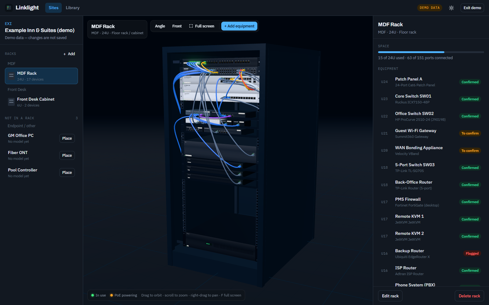
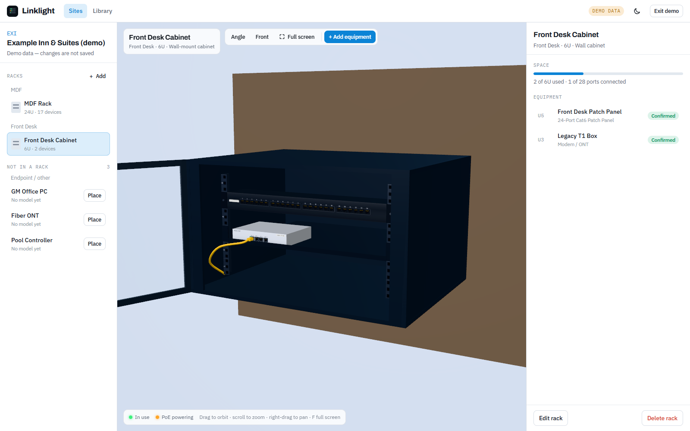
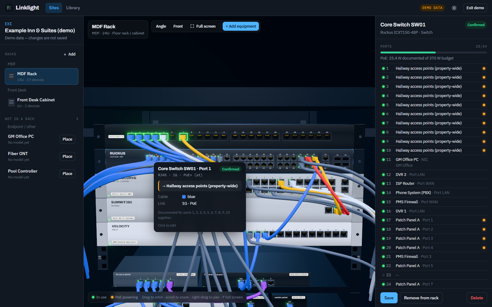
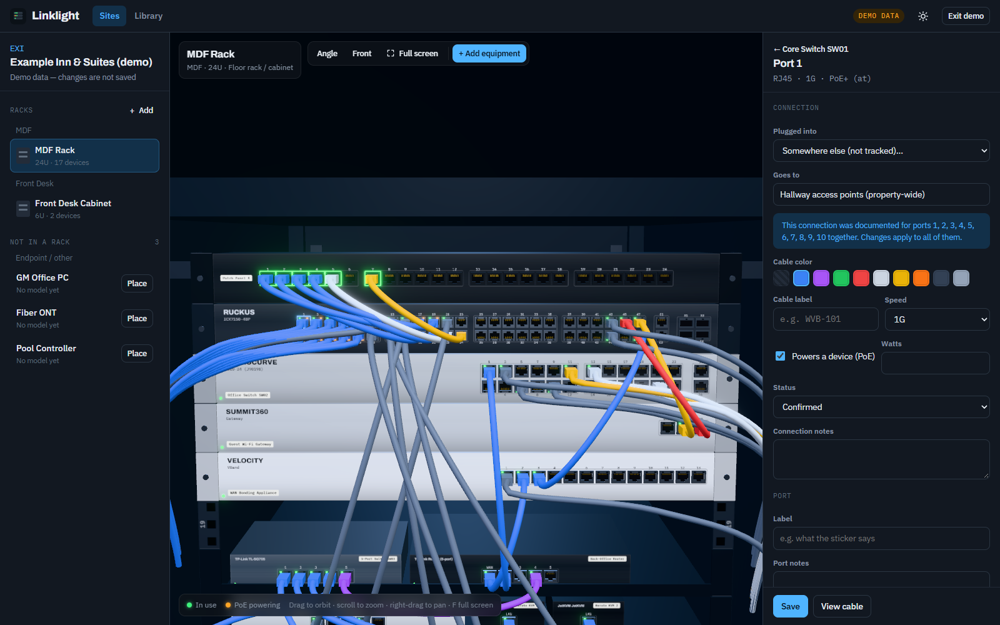
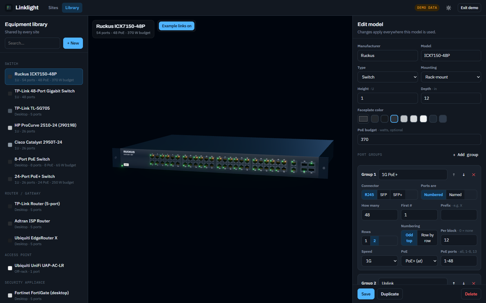
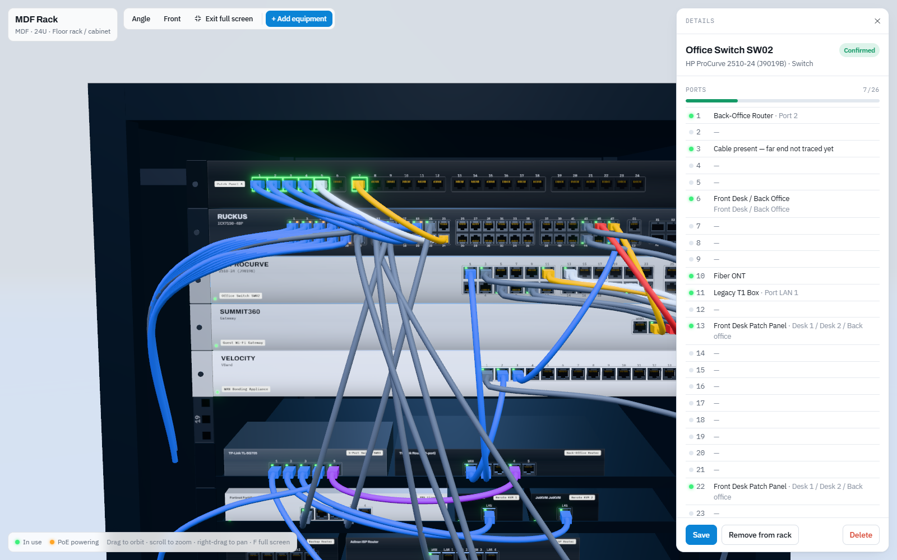
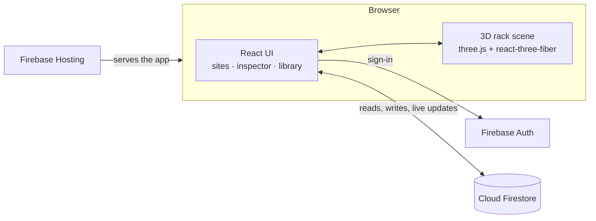

# Linklight

**Document your network closets as interactive 3D racks.**

Linklight shows every rack you look after as a 3D model you can rotate, zoom into and click
through. Ports glow green when something is documented as plugged into them, and amber when that
connection powers a device over PoE. Hovering a port shows where the cable goes, the cable's color
and label, the far end's IP and MAC address, and any photos taken of that port.

It's built for IT teams, MSPs and anyone responsible for networks across many sites (offices,
hotels, schools, retail) who is tired of answering "what's plugged into port 12?" by digging
through spreadsheets and phone photos.



> Screenshots use Linklight's built-in demo property, "Example Inn & Suites". All names and
> addresses in it are fictional.

---

## Contents

- [Features](#features)
- [How it works](#how-it-works)
- [Quick start (try it locally)](#quick-start-try-it-locally)
- [Set up your own Linklight](#set-up-your-own-linklight)
- [Deploying updates](#deploying-updates)
- [Managing users](#managing-users)
- [The equipment library](#the-equipment-library)
- [Migrating from Patchwork](#migrating-from-patchwork)
- [Project structure](#project-structure)
- [Security and privacy](#security-and-privacy)
- [Known limitations](#known-limitations)
- [Roadmap](#roadmap)
- [Team](#team)
- [License](#license)

---

## Features

### 3D racks you can move around

- Real 3D rendering (three.js). Drag to rotate, scroll to zoom, right-drag to pan.
- Click a device and the camera flies to it. **Front** snaps to a straight-on view for port work,
  and **Angle** returns to a three-quarter view.
- Four enclosure types: **floor rack / cabinet**, **wall-mount cabinet** (shown with its glass door
  open), **open frame / 2-post**, and **shelf / no rack**.
- Front rails show U numbers and cage-nut holes. Desktop gear such as small switches, routers and
  KVMs sits on rack trays, and several desktop devices can share one U.
- Faceplates are drawn from each model's specs, with no 3D modeling needed: brand and model text,
  a label-maker tape with the device's name, port blocks, port numbers and a power LED.



### Link lights

- 🟢 **Green:** a connection is documented on that port.
- 🟠 **Amber:** that connection powers a device over PoE, and the port supports PoE.
- Patch panel jacks get a green ring when they're in use.
- Cables are drawn in their documented color with real plugs (RJ45 boots or SFP modules). Patch
  cords between two devices in the same rack arc between their ports; runs that leave the rack are
  routed down the side like a dressed cable bundle.
- Lights reflect **documentation**, not live status. Live status is on the [Roadmap](#roadmap).

### Hover cards



Hovering a port shows:

- the device, port number, connector, speed and PoE standard
- what it's plugged into (device and port, or a free-text destination like "ISP hand-off")
- cable color and label, negotiated speed and PoE watts
- the IP and MAC of the device at the other end
- the room/plate label (on patch panels), notes and photos
- a ⚠ warning when two conflicting connections are documented on the same port

Devices, cables and empty U slots have hover cards too. An empty slot's card says "click to add
equipment here".

### Port editor and photos



Click any port to edit it:

- **Plugged into:** any device at the site, a specific port on it (in-use ports are flagged), or
  "somewhere else" with a free-text description.
- Cable color, cable label, speed, PoE on/off with watts, status (confirmed / to confirm /
  flagged) and connection notes.
- **Port label** (a room or wall-plate label on patch panels) and port notes.
- **Photos:** add as many as you like. They're shrunk automatically before saving and show up as
  thumbnails in the hover card and full size in a lightbox.

Device panels list every port at a glance (connection, label, PoE) and show PoE budget usage, IP,
MAC, notes, and **Move up / Move down** buttons for quick re-racking.

### Shared equipment library



A model is defined once and reused at every site. The editor has a live 3D preview with example
link lights.

- Manufacturer, model, type, mounting (rack / desktop / off-rack), height in U, width, depth, and
  faceplate color.
- **Port groups:** RJ45, SFP or SFP+; numbered (with optional prefix, e.g. `X1–X4`) or named
  (`WAN, DMZ, eth0…`); 1 or 2 rows; odd-on-top or row-by-row numbering; ports per block; speed;
  which ports supply PoE and to what standard (af / at / bt); total PoE budget.
- **Starter library** of about 24 common models: Ruckus ICX7150-48P, HP ProCurve 2510-24, Cisco
  Catalyst 2950T-24, TP-Link switches and routers, Ubiquiti EdgeRouter X and UniFi AP, FortiGate,
  JetKVM, generic patch panels, PoE switches, UPS units, DVRs and more.

### Sites, closets and racks

- Each site can have any number of racks. Racks with the same **location** (e.g. "1st Floor MDF",
  "2nd Floor IDF") are grouped as one closet in the sidebar.
- Add equipment by clicking an empty U, or with **+ Add equipment**. The dialog checks that it fits
  and suggests the first free position.
- Devices that aren't in a rack, such as access points and endpoints, are listed under **Not in a
  rack**. They can still be connection targets, and **Place** puts one into a rack.

### Light and dark mode, full-screen 3D



- **Theme:** the sun/moon button switches between light and dark. Linklight follows the
  operating-system setting until someone picks one, then remembers the choice in that browser.
  The 3D surroundings change with the theme; racks stay dark so the lights stand out.
- **Full screen:** press **F**, or click **Full screen** in the rack toolbar. The 3D view fills the
  screen, and clicking a port or device slides the details panel in on the right, so editing still
  works. **Esc** leaves.

### Built for teams

- **Live collaboration:** everyone sees the same data, and edits appear on other people's
  screens within a moment.
- **Activity log:** every change is written to the site's activity log.
- **Invite-only access:** only accounts you create can sign in, with an optional email-domain lock.

---

## How it works

| Layer | Technology |
|---|---|
| UI | React 19 + TypeScript, plain CSS with light/dark design tokens |
| 3D | three.js via `@react-three/fiber`, `@react-three/drei` (camera controls, lighting, grid), `@react-three/postprocessing` (bloom for the LEDs) |
| Build | Vite |
| Backend | Firebase: Authentication (email/password), Cloud Firestore (data + photos), Hosting |
| Optional import | `@supabase/supabase-js`, loaded only on the import page, to read a Patchwork database |



Linklight is a static single-page app: no server code, no Cloud Functions. The browser talks to
Firestore directly, and `firestore.rules` decides who may read or write. All storage goes through
one `Backend` interface (`src/lib/backend.ts`) with two implementations: Firebase (production) and
an in-memory demo used only during development.

### Data model (Cloud Firestore)

```
models/{modelId}                          shared equipment library
meta/library                              marks that the starter library has been added
properties/{siteId}                       name, code, address, notes
properties/{siteId}/racks/{rackId}        name, location (closet), kind, units, sort, notes
properties/{siteId}/devices/{deviceId}    name, type, status, notes, modelId, rackId, rackU (lowest U),
                                          ip, mac, photoId
properties/{siteId}/links/{linkId}        fromDevice/fromPort → toDevice/toPort or toExternal,
                                          cableColor, cableLabel, speed, poe, poeWatts, status, notes
properties/{siteId}/ports/{deviceId~port} label (room/plate), notes, photo refs
properties/{siteId}/photos/{photoId}      JPEG as a data URL (< 1 MB)
properties/{siteId}/activity/{id}         text, ts
```

### Ports and free-text port names

A device's ports come from its library model. Each port gets a **key** such as `12`, `X1`, `WAN` or
`Gi0/1`, and connections refer to those keys. Real-world documentation is often looser, so Linklight
also understands free-text port references (`resolvePortRefs` in `src/lib/ports.ts`):

| Written as | Lights up |
|---|---|
| `12` | port 12 |
| `Port 2 (DHCP)` | port 2 |
| `1 (uplink)` | port 1 |
| `43/44`, `Port 13/22` | both ports |
| `1–10`, `3–6 ("Tie Cables")` | the whole range |
| `Internet/WAN` | `WAN` |

### How the rack is drawn

- **Coordinates are in inches:** 1U = 1.75", rails are 19" apart, and device depth comes from the
  model.
- **Faceplates** are drawn onto a 2D canvas per device and used as a texture. Ports are real 3D
  meshes on top: a jack frame with the latch notch, a recessed interior, gold pins, and LEDs.
- **LED glow:** LEDs use colors brighter than white with tone mapping off, and a bloom pass picks
  up only those, so nothing else glows.
- **Cables** are tube meshes along bezier curves or routed paths. Plugs take the cable's color.
- **Layout:** `layoutFace` (in `src/lib/ports.ts`) places ports from the model's port groups.
  `layoutRack` and `checkFit` (in `src/lib/site.ts`) handle U positions, shared shelves and
  collision checks.

---

## Quick start (try it locally)

**Requirements:** Node.js 20+ and npm.

```bash
git clone https://github.com/TThimmesh/Linklight.git
cd Linklight
npm install
npm run dev
```

Open **http://localhost:5173/?demo**. That's the fictional demo property, held in memory, with
no Firebase needed. Changes reset when you reload.

| Command | Does |
|---|---|
| `npm run dev` | Starts the dev server |
| `npm run typecheck` | Runs the TypeScript checks |
| `npm run build` | Type-checks, then builds `dist/` |
| `npm run preview` | Serves the built `dist/` locally |
| `npm run deploy` | Builds, then deploys hosting and Firestore rules to Firebase |
| `npm run snapshot -- path/to/seed.sql` | Builds a local snapshot for previewing a Patchwork import (`?demo=migration`) |

The `?demo` modes exist **only in development builds** and are removed from production builds.

---

## Set up your own Linklight

Each installation is its own Firebase project. Everything fits on Firebase's free **Spark** plan;
no credit card is needed, because photos are stored in Firestore rather than Cloud Storage.

### 1. Create the Firebase project

1. In the [Firebase console](https://console.firebase.google.com), click **Create a project**.
   Google Analytics isn't needed.
2. **Authentication → Get started → Sign-in method → Email/Password →** enable it (not the
   email-link option).
3. **Authentication → Settings → User actions →** uncheck **Enable create (sign-up)**, so only
   accounts you add can sign in.
4. **Project settings → General → Your apps → Web (`</>`)** → register an app and keep its config
   values handy.

### 2. Create your local config files

Three files hold one installation's details. They're **gitignored**, so your values never end up in
the repo. Each one has a committed template:

```bash
cp public/config.example.js public/config.js
cp firestore.rules.example firestore.rules
cp .firebaserc.example .firebaserc
```

| File | What to set |
|---|---|
| `public/config.js` | `LINKLIGHT_FIREBASE`: the web app config from step 1.4 (needed for local dev; the hosted site can read it from Firebase Hosting automatically). `LINKLIGHT_SETTINGS` (optional): `allowedEmailDomains`, a sign-in `tagline`, and `patchworkImport` |
| `firestore.rules` | Your email domain in the `isTeam()` check, or delete that line to allow any account you create |
| `.firebaserc` | Your Firebase project ID |

### 3. Deploy

```bash
npm install -g firebase-tools
firebase login
npm run deploy
```

The first deploy switches on the Firestore API, creates the database, publishes your rules and
puts the site live at `https://<project-id>.web.app`. The starter equipment library is added
automatically the first time someone signs in.

Recommended extra step, which protects the database from accidental deletion:

```bash
firebase firestore:databases:update "(default)" --delete-protection ENABLED
```

## Deploying updates

```bash
npm run deploy
```

`index.html` and `config.js` are served with `no-cache`, and everything in `assets/` is
content-hashed and cached for a year (see `firebase.json`). A normal refresh therefore always
picks up a new deploy. To undo a release, go to Firebase console → **Hosting** → release history
→ **Roll back**.

## Managing users

- **Add someone:** Firebase console → **Authentication → Users → Add user**, with their email
  and a temporary password. They can choose their own password with **"Forgot password? / First
  time here?"** on the sign-in page.
- **Remove someone:** delete or disable the user in the same screen.
- **Everyone has full access.** There are no read-only or per-site roles yet (see
  [Roadmap](#roadmap)).
- **Ownership:** give the Firebase project at least two owners (**Project settings → Users and
  permissions**) so access never depends on one person's account.

## The equipment library

Models live in Firestore and are edited in the app (**Library**). The starter set is
`src/data/equipment-library.json`, which seeds an empty database once.

| Port group field | Meaning | Example |
|---|---|---|
| Connector | `RJ45`, `SFP` or `SFP+` (affects the jack/cage drawing) | `RJ45` |
| Ports are | **Numbered** (how many, first #, prefix) or **Named** (a list) | `48` from `1`; prefix `X` → `X1…`; `WAN, DMZ, LAN` |
| Rows | 1 or 2 | `2` |
| Numbering | **Odd top** (1 above 2, like most switches) or **Row by row** (like most patch panels) | `Odd top` |
| Per block | Ports per visual block; `0` = one continuous run | `12` |
| Speed | `10M` … `25G` | `1G` |
| PoE | None, af, at (PoE+) or bt (PoE++) | `PoE+ (at)` |
| PoE ports | Which ports supply power | `all`, `1-24`, `1-8, 13`, `WAN` |

Port names must be unique within a model; the editor blocks duplicates. A device keeps its
connections when its model changes, as long as the port keys still exist.

**Contributing models:** new entries in `src/data/equipment-library.json` are welcome. Use a stable
`id` (e.g. `vendor-model`), and keep notes generic (no site names).

## Migrating from Patchwork

Linklight is the successor to **Patchwork**, an earlier Supabase-based network documentation app.
Teams moving over can use the built-in importer:

1. In `public/config.js`, set `LINKLIGHT_SETTINGS.patchworkImport` to the Patchwork project's
   Supabase URL and publishable key. This makes **Import from Patchwork** appear on the Sites page.
2. Open **Import from Patchwork** and sign in with a Patchwork account. It's used only in the
   browser to read the data; it isn't stored, and the Patchwork database is never changed.
3. Review the sites found, then click **Import**. Every site, device (with its photo and saved
   credentials, if you choose), cable run and activity entry is copied over. Sites that already
   exist in Linklight are skipped, so running the import again is safe.

**Optional rack plan:** to have imported devices land in racks rather than under "Not in a rack",
write a rack plan at `src/data/migration-plan.local.json` (gitignored, since it describes real
sites). [`docs/migration-plan.example.json`](docs/migration-plan.example.json) shows the format:
racks to create, which library model each device is and where it sits, PoE flags, small fixes and
port labels. `npm run dev` with `?demo=migration` previews the result locally before you import
for real.

## Project structure

```
├─ docs/
│  ├─ screenshots/              images used in this README
│  └─ migration-plan.example.json
├─ firebase.json                Hosting config (cache headers) + Firestore config
├─ firestore.rules.example      security rules template → copy to firestore.rules
├─ firestore.indexes.json
├─ .firebaserc.example          project ID template → copy to .firebaserc
├─ index.html                   page shell (applies the saved theme before first paint)
├─ public/config.example.js     settings template → copy to public/config.js
├─ scripts/snapshot-legacy.mjs  Patchwork seed.sql → local snapshot for ?demo=migration
├─ src/
│  ├─ main.tsx                  entry: Firebase app, or a dev-only demo
│  ├─ App.tsx                   shell: top bar, routing, library seeding
│  ├─ AuthGate.tsx              sign-in / password reset / domain check
│  ├─ styles.css                design tokens (light + dark) and all styles
│  ├─ data/equipment-library.json   starter models
│  ├─ lib/
│  │  ├─ types.ts               shared types and constants
│  │  ├─ ports.ts               port keys, PoE ranges, faceplate layout, free-text port matching
│  │  ├─ site.ts                connection index, rack placement, fit checks
│  │  ├─ backend.ts             the Backend interface + image helpers
│  │  ├─ firebaseBackend.ts     Firestore implementation (with live-update cache)
│  │  ├─ firebase.ts            config loading + allowed email domains
│  │  ├─ settings.ts            per-deployment settings from config.js
│  │  ├─ importer.ts            Patchwork → Linklight conversion + rack plans
│  │  ├─ demoBackend.ts         in-memory backend with the fictional demo (dev only)
│  │  ├─ hooks.ts               data loading, hover state, photo URLs, routing
│  │  ├─ theme.ts               light/dark mode
│  │  └─ useFullscreen.ts       full-screen handling with a fallback
│  ├─ three/
│  │  ├─ RackScene.tsx          scene, lights, camera, hover/click wiring
│  │  ├─ Enclosure.tsx          floor rack, wall cabinet, open frame, shelf, trays
│  │  ├─ DeviceUnit.tsx         device body, faceplate, ears, ports, LEDs
│  │  ├─ Cables.tsx             patch cords, runs and plugs
│  │  ├─ ModelPreview.tsx       single-model preview for the library
│  │  ├─ parts.ts               shared geometry and materials
│  │  └─ textures.ts            canvas-drawn faceplates and rail textures
│  ├─ components/               hover card, inspector panels, dialogs, shared UI
│  ├─ pages/                    Home, Site (rack view), Library, Import
│  └─ dev/demo.ts               dev-only demo entry points
├─ SPEC.md                      design decisions and milestones
└─ package.json
```

## Security and privacy

- **Who can get in:** with sign-up disabled, only accounts you create can sign in. Your
  `firestore.rules` can also require a specific email domain, and every read and write is checked
  against it.
- **No installation details in the repo:** `public/config.js`, `firestore.rules`, `.firebaserc`,
  rack plans and snapshots are gitignored, and only templates are committed.
- **Public keys:** Firebase web config values are public identifiers. They're designed to be visible
  in the browser and grant nothing on their own; the rules are what protect the data.
- **Photos and credentials** imported from Patchwork live in Firestore under the same rules.
  Credentials aren't displayed in the app yet.
- **No real data in the bundle:** demo data is fictional and only exists in development builds.

## Known limitations

- **Documentation only:** link lights show what's documented, not what's live.
- **Front only:** only the front of gear is modeled; ports physically on the back are drawn on
  the front.
- **Desktop first:** hover cards need a mouse; phones and tablets work but aren't optimized yet.
- **No roles yet:** everyone who can sign in can edit everything.
- **Bundle size:** the app is about 600 KB gzipped (three.js + Firebase), so the first load is
  slower on poor connections. It's cached afterwards.
- **Free-plan limits:** Firestore's free tier (50k reads / 20k writes per day, 1 GiB) suits small
  teams. Each photo is kept under about 1 MB after automatic shrinking.

---

## Roadmap

### Done

- **Rack view:** sites and racks, the shared library with a 3D preview, adding and placing
  equipment, link lights, cables, hover cards, the port editor and port photos.
- **Firebase backend:** invite-only access, live collaboration, the activity log.
- **Patchwork importer** with optional rack plans.
- **Light/dark mode** and **full-screen 3D**.

### Next up: closets and off-rack gear

- A **site overview** with every closet (MDF and IDFs) side by side; click one to open it.
- Racks in the **same closet shown together** in one 3D scene.
- An **off-rack panel grouped by floor → room** (APs, cameras, TVs, endpoints).
- Clicking an AP or endpoint **highlights the switch port that feeds it** and flies the camera there.

### Then: more ways to see the data

- **Network graph view**, showing devices and cable runs as a force-directed graph.
- **Table view** of devices and cable runs with search, filters and export.
- **Device credentials** shown behind a "Show" button (they're already stored when imported).
- **Findings and recommendations** per site.
- An **activity feed** view (activity is already recorded).
- **Global search** across sites, devices, ports, labels and IP addresses.

### Later: under consideration

These are ideas, not commitments.

- **Live link status** pulled from controllers (UniFi, Ruckus, Fortinet) alongside the documented state.
- **Rear-of-rack modeling:** power supplies, rear ports, PDUs.
- **Floor plans** with AP and camera pins.
- **Roles:** read-only accounts, or vendor accounts limited to specific sites.
- **Printable rack elevations and port maps** (PDF).
- **Tablet/phone mode:** tap instead of hover, and taking photos straight from the closet.
- **Drag-and-drop** to move gear between U positions.
- **PoE budget warnings** and port-usage reports across sites.
- **Scheduled backups/exports** of Firestore data.
- **Automatic deploys** from GitHub (GitHub Actions → Firebase Hosting).
- **Cloud Storage for photos** as an option for larger installations.

---

## Team

Linklight is designed and built by:

- **Taylor Thimmesh**
- **Jackson Hurst**
- **Aaron Mills**

## License

No license has been chosen yet, so all rights are reserved by the authors for now. Open an issue
if you'd like to use Linklight; an open-source license is being considered.
